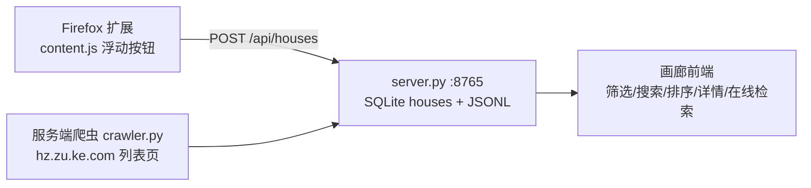

# 杭州租房工具（贝壳 hz.zu.ke.com）

> 由 [fde-job-search / FDE_JobSearch](https://github.com/Guuumiho/FDE_JobSearch)（BOSS 直聘 JD 采集 MVP）全面重构而来：
> 同样的「浏览器扩展采集 + 本地服务入库 + 画廊前端」架构，检索对象换成 **贝壳找房·杭州租房（hz.zu.ke.com/zufang）**。


## 它能做什么

- **在线检索**：本地服务直接抓取 `hz.zu.ke.com/zufang` 列表页（区域/价格档/居室/整租合租/关键词/排序/多页），解析后入库；
- **浏览器扩展采集**：在你已登录的贝壳页面里，列表页「采集本页 / 自动翻页」、详情页「保存房源 / 导出TXT」；
- **本地房源库**：SQLite + JSONL 双写，URL 去重（重复抓取自动更新而非新增）；
- **画廊前端**：卡片墙（图片/月租/标签/户型面积朝向楼层）、五维筛选、关键词搜索、四种排序、详情弹窗、区域均价统计、双主题。

## 架构



### 站点约束（2026-09 实测，重要）

| 页面 | 匿名访问 | 说明 |
|------|:--:|------|
| `/zufang/` 综合首页（30 条/页） | ✅ | 服务端爬虫默认入口 |
| 分页 `/zufang/pg2/`、区域/价格/居室/关键词筛选页 | ❌ 登录墙 | 需提供 Cookie（`data/cookie.txt` 或检索面板），或用扩展在已登录浏览器内采集 |
| 详情页 `/zufang/HZ*.html` | ❌ 登录页 | 仅扩展（用户浏览器内）可采集详情字段与描述 |

命中登录墙时服务端返回 `login_required` 并给出目标 URL 与建议；扩展路线不受影响。

### 筛选 URL 规则（实测）

`https://hz.zu.ke.com/zufang/[区域slug]/[pg页码][rt方式][rp价格档][l居室][排序][rs关键词]/`

- 区域：`shangchengqu` `gongshuqu` `xihuqu4`（注意西湖区 slug 带 4）`binjiangqu` `xiaoshanqu` `yuhangqu` `linpingqu` `qiantangqu` `fuyangqu` `linanqu` `jiandeshi` `tongluxian` `chunanxian` `hainingshi`
- 价格档：`rp1` ≤1000 … `rp8` ≥10000（8 档）
- 居室：`l0` 一居 / `l1` 两居 / `l2` 三居 / `l3` 四居+
- 方式：`rt200600000001` 整租 / `rt200600000002` 合租
- 排序：`rco11` 最新上架 / `rco21` 价格

## 快速开始

```bash
# 1. 启动本地服务（默认 http://127.0.0.1:8765，可用环境变量 RENTAL_PORT 改端口）
cd 01_house_capture/local-service
python3 server.py          # Windows: 双击 run.cmd 或 python server.py

# 2. 打开画廊
#    http://127.0.0.1:8765/

# 3.（可选）安装 Firefox 扩展：about:debugging → 此电脑 → 加载临时附加组件
#    选择 01_house_capture/firefox-house-capture/manifest.json
#    然后打开 hz.zu.ke.com/zufang，用浮动按钮采集
```

无第三方依赖：Python 标准库 + 原生 JS。

## API

| 方法 | 路径 | 说明 |
|------|------|------|
| GET | `/api/houses?q=&district=&rooms=&minRent=&maxRent=&rentType=&sort=` | 筛选后的房源列表（sort: updated/rent_asc/rent_desc/area_desc/area_asc） |
| POST | `/api/houses` | 入库：`{houses:[...]}` / `{house:{...}}` / 单个对象 / 数组，按 url upsert |
| POST | `/api/crawl` | 在线检索：`{district, priceTier, rooms, rentType, sort, keyword, pages, cookie?}` |
| GET | `/api/meta` | 筛选项元数据（区域/价格档/居室/方式/排序/Cookie 状态） |
| GET | `/api/stats` | 总数、均价、分区域统计 |
| GET | `/health` | 健康检查 |

## 目录结构

```text
hz-rental-tool/
└── 01_house_capture/
    ├── firefox-house-capture/      # Firefox 扩展（MV2）
    │   ├── manifest.json
    │   ├── background.js           # 转发 POST /api/houses、导出TXT下载
    │   └── content.js              # 列表页批量/翻页采集、详情页保存
    ├── local-service/
    │   ├── server.py               # HTTP 服务 + SQLite/JSONL 存储 + API
    │   ├── crawler.py              # hz.zu.ke.com 抓取/解析/URL 构造（纯标准库）
    │   ├── run.cmd / run.sh
    │   └── public/                 # 画廊前端（index.html + assets）
    ├── data/                       # houses.db / houses.jsonl / cookie.txt（gitignore）
    └── tests/
        ├── test_parser.py          # 解析器离线测试（9 用例）
        └── fixtures/               # 真实列表页样本
```

## 测试

```bash
cd 01_house_capture
python3 tests/test_parser.py
```

## 合规提示

- 仅供个人找房使用；抓取频率默认保守（页间隔 1.5s、单次上限 30 页）；
- 请遵守贝壳的服务条款与 robots 约定，勿用于商业再分发；
- Cookie 仅存本地 `data/cookie.txt`，不会上传任何第三方。
