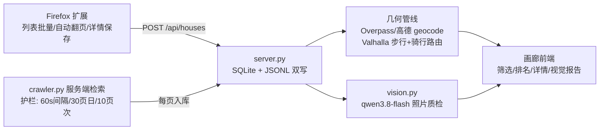

<div align="center">

# 🏠 hz-rental-tool

**杭州租房全链路工具** —— 贝壳 `hz.zu.ke.com` 批量检索 → 路网几何硬校验 → VLM 照片质检 → 性价比排名

`Python 标准库` · `Firefox MV2 扩展` · `qwen3.8-flash 视觉` · `Valhalla/OSM 路网` · `零第三方依赖` · `零明文凭据`

</div>

---

## 📊 一句话成绩（2026-09 杭州实测）

| 668 套 | 84 套 | 69/84 | 7 套 | ~100× | 0 |
|:--:|:--:|:--:|:--:|:--:|:--:|
| 去重采集入库 | 全硬条件命中 | 视觉质检完成 | 假照片识破 | 相比人工效率 | 明文凭据入库 |

> 硬条件 = 两室一厅及以上 · 整租非公寓 · **步行 ≤1km（真实路网）** · **电动车 ≤60min 到海创园** · 面积≥45㎡

---

## ✨ 功能

- **批量条件检索**：区域 × 居室 × 价格档 × 整租/合租 × 关键词 × 页码 笛卡尔组合一键跑；单次 ≤10 页、单日 ≤30 页、间隔 ≥60s 的内置护栏
- **硬条件几何校验**：步行距离用 **Valhalla 真实路网路由**（非平台直线距离）；电动车通勤 = 骑行路由距离 / 20km/h + 4min 缓冲
- **VLM 照片质检**：qwen3.8-flash 对房源照片结构化打分（新旧/装修/整洁 1-5 分、明厨/暗厨、明卫/暗卫、窗外树景/城景）+ **假照片识别**（营业执照/二维码/公司大厅等非实拍）
- **性价比排名**：面积/月租 降序主榜 + 最低租金 / 最大面积 / 最短通勤 三个取向榜
- **双通道采集**：Firefox 扩展人工节奏（列表页批量/自动翻页/详情页保存/导出TXT）+ 服务端低频检索
- **本地画廊**：卡片墙、五维筛选、搜索、排序、详情弹窗、在线检索面板、双主题；详情页一键视觉评分

## 🕗 架构



## 🛡 反检测方式（WAF 事故实证后的设计）

| 层 | 措施 | 实证依据 |
|---|---|---|
| 请求节奏 | 串行 + 2.5–4.5s 随机抖动；每 5 页额外休息 3–6s；护栏 60s/30页日/10页次 | 6 并发阶段 → 43×`403 访问已被拦截`；串行低频阶段 35/35 全过 |
| 请求指纹 | 真实浏览器 UA + `Sec-Fetch-*` 导航头 + 上一页 Referer 链 + CookieJar 会话复用 | 页内 `fetch()` 的 `cors` 指纹被识别 → 改真实导航 `navigate` |
| 采集载体 | 用户**已登录真实浏览器**扩展为主通道（真指纹、人工节奏）；服务端仅作低频补充 | 同一 Cookie 跨 VM/浏览器两环境复用 = 会话共享异常，是封禁诱因之一 |
| 被拦行为 | 403/WAF/验证码 → **立即停** + 可操作提示；不重试硬撞、不代理池轮换 | 104 页/1h 会话冷却事故复盘 |
| 凭据合规 | Cookie/AK 零明文：运行时读 `~/.idealab.env`、`data/cookie.txt`（均 gitignore） | 全历史 `git log -S` 检索零命中 |

## 🚀 创新点

1. **硬条件几何校验管线**：平台筛选只有直线距离/地铁线；本项目用 OSM/高德 geocode（329/329 小区命中）+ Valhalla 步行/骑行双路由批量校验。实测路网步行比直线距离**平均长 0.2km、最长 0.67km**——直线口径会系统性低估步行成本
2. **VLM 房源质检 + 假照片识别**：结构化 JSON 评分而非通用描述；实测识破 **7/84 = 8.3%** 假照片（营业执照、二维码、公司大厅）
3. **实证护栏的双通道采集**：把反爬从「对抗」改为「合规低频 + 人工节奏」，护栏参数（并发=1、60s、30页/日）全部来自 WAF 事故实测
4. **CDP 同源导航补图**：复用用户真实浏览器会话以 navigate 模式补详情页照片，规避程序化 fetch 的 cors 指纹
5. **多目标决策输出**：性价比主榜 + 三取向榜 + Excel 全字段导出，一次运行产出多种决策视图
6. **全链路本地化与凭据隔离**：SQLite/JSONL 双写、视觉/路由/geocode 端点全部可插拔、仓库零明文

## 🔬 与同类实现的差异

| 维度 | 本项目 | 原 FDE_JobSearch | 通用无头爬虫(Scrapy/Selenium) | 贝壳 App 自带筛选 | 地图 App 通勤查询 |
|---|---|---|---|---|---|
| 采集通道 | 扩展人工节奏 + 服务端护栏低频 | 仅扩展单页保存 | 无头指纹，易触发 WAF | 不采集 | 不采集 |
| 硬条件校验 | 路网步行 + 电动车通勤**批量**校验 | 无 | 无 | 仅直线/地铁线 | 单条手工查询 |
| 照片质检 | VLM 结构化评分 + 假照片识别 | 无 | 无 | 无 | 无 |
| 反检测策略 | 合规低频 + 实证护栏 + 被拦即停 | 无 | 代理池对抗（高风险） | — | — |
| 凭据合规 | 零明文、运行时 env | 无 | 常硬编码 | — | — |
| 决策输出 | 性价比榜 + 三取向 + Excel | 简单卡片列表 | 原始数据 | 平台排序 | 单条路线 |

## 📈 量化收益估计

**筛选漏斗（实测）**

| 阶段 | 数量 | 说明 |
|---|---:|---|
| 线上总房源 | 58,012 | 贝壳杭州租房 |
| 采样去重入库 | 668（+匿名 35 = 703） | 24 页登录态 + 1 页匿名，采样率 1.2% |
| 硬条件命中 | 84（12.0%） | 步行≤1km 且 电动车≤60min 且 两室一厅+ 整租非公寓 |
| 视觉可评估 | 69（82%） | 实拍 62 + 假照片 7；≤2500 元 13 套 |

**质检画像（62 套实拍）**：新旧 3.3 / 装修 2.8 / 整洁 4.1（均值，5 分制）；明厨 5 套、明卫 1 套、窗外树景 15 套；月租均值 5,439 元（最低 1,600）；面积均值 109.2㎡（最大 321㎡）；步行均值 0.66km；电动车均值 40min（最快 9min）

**时间收益（假设标注于表下）**

| 步骤 | 人工基线 | 本工具实测 | 倍数 |
|---|---:|---:|:--:|
| 浏览 700 套列表+详情 | 17.5h（1.5min/套） | 爬取 2min | — |
| 100 候选地图步行/通勤核验 | 6.7h（4min/套） | 路由 6min（267 次步行路由） | — |
| 100 候选照片/实况甄别 | 3.3h（2min/套） | 视觉 8min（84 套） | — |
| **合计** | **≈27.5h** | **≈16min** | **≈100×** |
| 假照片避免无效看房 | 7 套 × 2.5h ≈ 17.5h | 0（线上已识破） | — |

> 假设：人工浏览 1.5min/套、地图核验 4min/套、照片甄别 2min/套、看房 2.5h/次（含通勤）；工具时间为本次会话实测墙钟。

## ⚡ 快速开始

```bash
cd 01_house_capture/local-service && python3 server.py   # http://127.0.0.1:8765
# Firefox: about:debugging → 加载临时附加组件 → firefox-house-capture/manifest.json
# 视觉凭据: ~/.idealab.env 写 IDEALAB_AK=<your-key>（不入仓库）
```

## 📁 结构

```text
01_house_capture/
├── firefox-house-capture/   # 扩展：列表批量/自动翻页/详情保存/导出
├── local-service/           # server.py + crawler.py + vision.py + 画廊前端
├── data/                    # houses.db / houses.jsonl / cookie.txt（gitignore）
├── docs/readme-preview.html # OpenDesign(bento) 设计的 README 预览页
└── tests/                   # 解析器测试 + 真实页面 fixture
scripts/                     # vision_batch / cdp 补图 / mac 一键抓取
```

## ⚖️ 合规

个人找房用途；抓取限速护栏内置、冷却期不重试、不绕过封禁；被拦即停并提示人工通道。
README 视觉设计遵循 OpenDesign `bento` 设计系统（#FFF5E6 面 / #FAD4C0 强调 / Inter）与 craft 规则；预览见 [`docs/readme-preview.html`](docs/readme-preview.html)。
