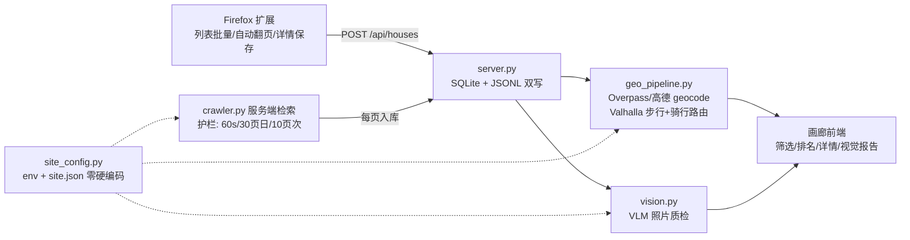

<div align="center">

# ⚡ 一秒选房 · 全国租房硬条件校验工具

**批量检索 → 路网几何硬校验 → VLM 照片质检 → 性价比排名**；城市与站点全配置化，**全国通用**

`Python 标准库` · `Firefox MV2 扩展` · `VLM 视觉质检` · `Valhalla/OSM 路网` · `零第三方依赖` · `零明文凭据` · `零硬编码`

</div>

---

## 📊 实测成绩（杭州样例城市，2026-09）

| 668 套 | 84 套 | 69/84 | 7 套 | ~100× | 0 |
|:--:|:--:|:--:|:--:|:--:|:--:|
| 去重采集入库 | 全硬条件命中 | 视觉质检完成 | 假照片识破 | 相比人工效率 | 明文凭据入库 |

> 硬条件示例 = 两室一厅及以上 · 整租非公寓 · **步行 ≤1km（真实路网）** · **电动车 ≤60min 到配置通勤点** · 面积下限可配

---

## 🌏 全国通用：零硬编码配置层

所有城市/站点/通勤点/区域均来自配置，**改配置不换代码**：

| 配置项 | 环境变量 | data/site.json 键 | 说明 |
|---|---|---|---|
| 城市 slug | `RENTAL_CITY_SLUG` | `city_slug` | 用于站点 URL 模式 `{city}` 占位 |
| 站点 URL 模式 | `RENTAL_SOURCE_URL_PATTERN` | `source_url_pattern` | 默认适配器匹配 zu.ke.com 族域名，可整体替换 |
| 列表页路径 | `RENTAL_LIST_PATH` | `list_path` | 默认 `/zufang/` |
| 通勤终点 | `RENTAL_COMMUTE_DEST` | `commute_destination` | `lat,lon` 或站点/园区名（运行时 geocode） |
| 城市 bbox | — | `city_bbox` | 地铁站/小区 geocode 范围；缺省用 `--city-name` 走 Overpass 行政边界 |
| 高德城市码 | `RENTAL_AMAP_CITY_CODE` | `amap_city_code` | geocode 兜底通道，可选 |
| 区域预设 | — | `districts` | 可空；空则 `/api/discover` 从列表页**动态解析**（实测单页发现 69 个区域筛选） |

示例预设：`cp 01_house_capture/docs/site.example.json 01_house_capture/data/site.json`（杭州样例；换城市改 4 个字段即可）。

## ✨ 功能

- **批量条件检索**：区域 × 居室 × 价格档 × 整租/合租 × 关键词 × 页码 笛卡尔组合一键跑；单次 ≤10 页、单日 ≤30 页、间隔 ≥60s 内置护栏
- **硬条件几何校验**（`scripts/geo_pipeline.py`）：步行 ≤1km 用 **Valhalla 真实路网**（非平台直线距离）；电动车通勤 = 骑行路由 / 可配时速 + 缓冲；地铁站/小区坐标 Overpass+高德双通道 geocode
- **VLM 照片质检**（`vision.py`）：结构化打分（新旧/装修/整洁 1-5、明厨/暗厨、明卫/暗卫、窗外树景/城景）+ **假照片识别**（营业执照/二维码/公司大厅等非实拍）；模型/端点 env 可换
- **性价比排名**：面积/月租 主榜 + 最低租金 / 最大面积 / 最短通勤 三取向榜 + Excel 全字段导出
- **双通道采集**：Firefox 扩展人工节奏（`*.zu.ke.com` 全城市通配：列表批量/自动翻页/详情保存/导出TXT）+ 服务端低频检索
- **本地画廊**：卡片墙、五维筛选、搜索、排序、详情弹窗、在线检索面板、一键视觉评分、双主题

## 🕗 架构



## 🛡 反检测方式（WAF 事故实证后的设计）

| 层 | 措施 | 实证依据（杭州样例） |
|---|---|---|
| 请求节奏 | 串行 + 2.5–4.5s 随机抖动；每 5 页休息 3–6s；护栏 60s/30页日/10页次 | 6 并发阶段 → 43×`403 访问已被拦截`；串行低频 35/35 全过 |
| 请求指纹 | 真实浏览器 UA + `Sec-Fetch-*` 导航头 + 上一页 Referer 链 + CookieJar 会话复用 | 页内 `fetch()` 的 `cors` 指纹被识别 → 改真实导航 `navigate` |
| 采集载体 | 用户**已登录真实浏览器**扩展为主通道；服务端低频补充 | 同一 Cookie 跨环境复用 = 会话共享异常，封禁诱因之一 |
| 被拦行为 | 403/WAF/验证码 → **立即停** + 可操作提示；不重试硬撞、不代理池轮换 | 104 页/1h 会话冷却事故复盘 |
| 凭据合规 | Cookie/AK 零明文：运行时 env 文件读取，gitignore 双保险 | 全历史 `git log -S` 零命中 |

## 🚀 创新点

1. **硬条件几何校验管线**：平台筛选只有直线距离/地铁线；本工具 Overpass/高德 geocode（样例城市 329/329 小区命中）+ Valhalla 步行/骑行双路由批量校验；实测路网步行比直线**平均长 0.2km、最长 0.67km**
2. **VLM 质检 + 假照片识别**：结构化 JSON 评分而非通用描述；实测识破 **7/84 = 8.3%** 假照片
3. **实证护栏双通道采集**：反爬从「对抗」改为「合规低频 + 人工节奏」，参数（并发=1/60s/30页日）来自 WAF 事故实测
4. **CDP 同源导航补图**：复用用户真实浏览器 navigate 模式补详情页照片，规避程序化 fetch 的 cors 指纹
5. **配置层零硬编码**：城市/站点/通勤点/区域全配置化 + 区域动态发现，全国城市不改代码切换
6. **多目标决策输出**：性价比主榜 + 三取向榜 + Excel；一次运行多决策视图

## 🔬 与同类实现的差异

| 维度 | 本工具 | 原 JD 采集 MVP | 通用无头爬虫 | 平台 App 自带筛选 | 地图 App 通勤查询 |
|---|---|---|---|---|---|
| 采集通道 | 扩展人工节奏 + 服务端护栏低频 | 仅扩展单页保存 | 无头指纹易触 WAF | 不采集 | 不采集 |
| 硬条件校验 | 路网步行 + 电动车通勤**批量** | 无 | 无 | 仅直线/地铁线 | 单条手工 |
| 照片质检 | VLM 结构化评分 + 假照片识别 | 无 | 无 | 无 | 无 |
| 城市覆盖 | **全国配置化** | 单站硬编码 | 取决于脚本 | 单城 | 单城 |
| 反检测 | 合规低频 + 实证护栏 + 被拦即停 | 无 | 代理池对抗（高风险） | — | — |
| 决策输出 | 性价比榜 + 三取向 + Excel | 卡片列表 | 原始数据 | 平台排序 | 单条路线 |

## 📈 量化收益估计（杭州样例实测）

| 阶段 | 数量 | 说明 |
|---|---:|---|
| 线上总房源 | 58,012 | 样例城市 |
| 采样去重入库 | 668（+匿名 35 = 703） | 24 页登录态 + 1 页匿名，采样率 1.2% |
| 硬条件命中 | 84（12.0%） | 步行≤1km 且 电动车≤60min 且 户型/整租/面积硬条件 |
| 视觉可评估 | 69（82%） | 实拍 62 + 假照片 7；≤2500 元 13 套 |

**质检画像（62 套实拍）**：新旧 3.3 / 装修 2.8 / 整洁 4.1；明厨 5 · 明卫 1 · 树景 15；月租均值 5,439（最低 1,600）；面积均值 109.2㎡（最大 321㎡）；步行均值 0.66km；电动车均值 40min（最快 9min）

**时间收益**

| 步骤 | 人工基线 | 本工具实测 |
|---|---:|---:|
| 浏览 700 套列表+详情 | 17.5h | 爬取 2min |
| 100 候选地图核验 | 6.7h | 路由 6min（267 次步行路由） |
| 100 候选照片甄别 | 3.3h | 视觉 8min |
| **合计** | **≈27.5h** | **≈16min（≈100×）** |
| 假照片避免无效看房 | 7×2.5h ≈ 17.5h | 0（线上已识破） |

> 假设：浏览 1.5min/套、核验 4min/套、甄别 2min/套、看房 2.5h/次；工具时间为实测墙钟。

## ⚡ 快速开始

```bash
cp 01_house_capture/docs/site.example.json 01_house_capture/data/site.json   # 城市预设（可改任意城市）
cd 01_house_capture/local-service && python3 server.py                        # http://127.0.0.1:8765
# Firefox: about:debugging → 加载临时附加组件 → firefox-house-capture/manifest.json
# 视觉凭据: env 或 ~/.idealab.env（VISION_API_BASE/VISION_API_KEY/VISION_MODEL 可换任意兼容端点）
# 几何管线: python3 scripts/geo_pipeline.py --dest "lat,lon|站点名" [--bbox s,w,n,e | --city-name 城市]
```

## 📁 结构

```text
01_house_capture/
├── firefox-house-capture/   # 扩展（*.zu.ke.com 全城市通配）
├── local-service/           # server.py / crawler.py / vision.py / site_config.py / 画廊前端
├── data/                    # houses.db / houses.jsonl / site.json / cookie.txt（gitignore）
├── docs/                    # site.example.json + readme-preview.html（OpenDesign bento）
└── tests/                   # 解析器测试 + 样例 fixture
scripts/                     # geo_pipeline / vision_batch / cdp 补图 / mac_crawl（全参数化）
```

## ⚖️ 合规

个人找房用途；限速护栏内置、冷却期不重试、不绕过封禁；被拦即停并提示人工通道。
README 视觉设计遵循 OpenDesign `bento` 设计系统；预览见 [`docs/readme-preview.html`](01_house_capture/docs/readme-preview.html)。
